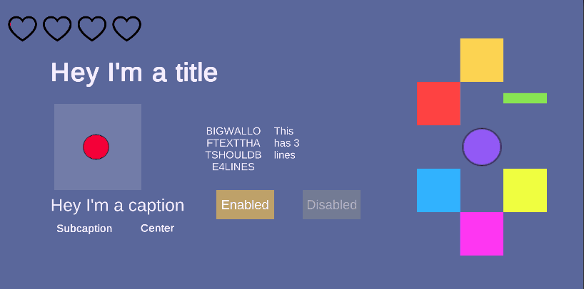

# UGUIDOTS.Sample

A sample repository of demoing [UGUIDOTS](https://github.com/InitialPrefabs/UGUIDots/tree/master). 

## Dependencies
* Unity 2020.1bx
* Burst 1.3.0-preview.10
* Entities 0.9.1-preview.15
* Jobs 0.2.8-preview.3
* Collections 0.7.1-preview.3
* UGUI 1.0.0
* Universal RP 0.9.0-preview.14
* TextMeshPro 0.3.0-preview.11

## Quickstart

* Clone the repository
* Add the dependencies listed above via the package manager
* Add the UGUIDOTS.Sample repository as a submodule or download the zip and extract it to your project 
* Open up the `Scenes/RectTransformConversionTest.unity` scene which shows the basic structure of how to set up a UI

## Build Information
The repository uses Unity's new configurable build pipelines, head over to the `BuildConfigurations` directory if you 
would like to build for a specific platform. The ***typical build pipeline will not work.*** 

> The Build Pipeline will be updated to the latest version as soon as I understand the process of how it works with DOTS.

Currently the only ones supported and verified to work are:

* Linux-Standalone
* Windows-Standalone
* macOS-Standalone
* Android Oreo and higher

## Demo

### Anchoring & Scaling

### Basic Button Support (Standalone/Mobile)

### Static Analysis and Batching to reduce Draw Calls

### Fill Amount & Translation Shaders

