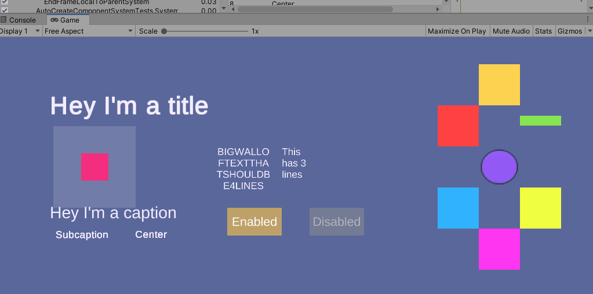
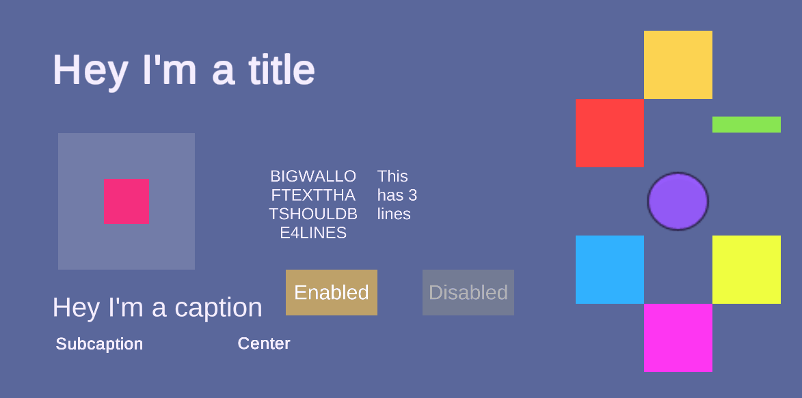
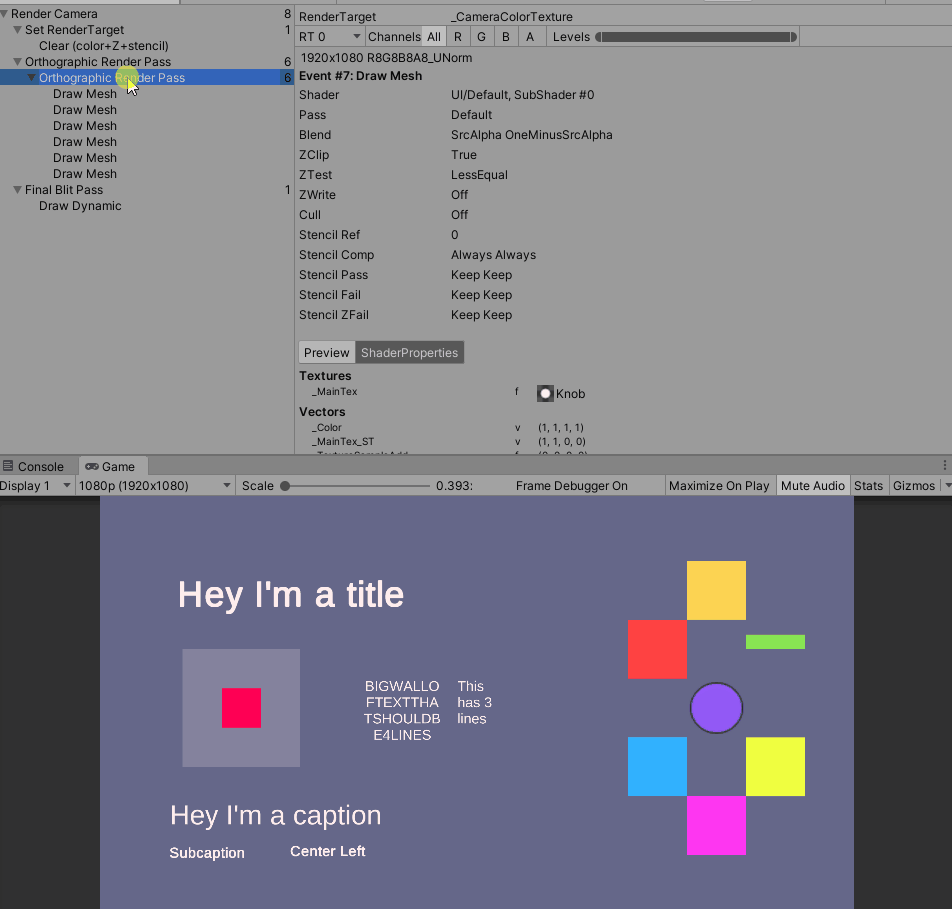

# UGUIDOTS.Sample

A sample repository of demoing [UGUIDOTS](https://github.com/InitialPrefabs/UGUIDots/tree/master). 

## Dependencies
* Unity 2020.1bx

Please grab the following from the package manager

* Entities - 0.8.0-preview.8
* Collections - 0.7.0-preview.2
* Jobs - 0.2.7-preview.11
* Mathematics - 1.1.0
* Unity UI - 1.0.0
* TextMeshPro - 3.0.0-preview.1

## Quickstart

* Add the dependencies listed above via the package manager
* Add UGUIDots as a submodule or download the zip and store it into your project.
* Add the UGUIDOTS.Sample repository as a submodule or download the zip and extract it to your project 
* Open up the `Scenes/RectTransformConversionTest.unity` scene which shows the basic structure of how to set up a UI

## Build Information
The repository uses Unity's new configurable build pipelines, head over to the `BuildConfigurations` directory if you 
would like to build for a specific platform. The ***typical build pipeline will not work.***

Currently the only ones supported and verified to work are:

* Linux-Standalone
* Windows-Standalone
* macOS-Standalone
* Android Oreo and higher

## Demo

### Anchoring & Scaling

### Basic Button Support (Standalone/Mobile)

### Static Analysis and Batching to reduce Draw Calls
